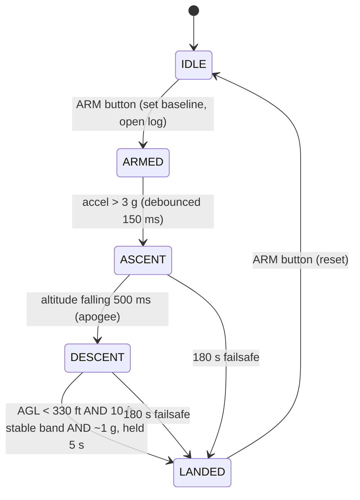

# RPD Avionics: Design and Flight Post-Mortem

A full write-up of the **Rocket Position Data recorder (RPD)**, the flight data logger flown by UKC AstraNova at the UKSEDS National Rocketry Championship 2025-26. This document covers the hardware, the firmware, and a complete root-cause analysis of why the board returned no flight data, with the design changes that follow from it.

> **Scope:** this is the avionics subsystem only. The vehicle-level recovery failure is summarised where it matters for context, but the RPD is the focus.

## Summary

The RPD is a self-contained logger on a 2-layer PCB; a **Raspberry Pi Pico 2 (RP2350)** reads a **Waveshare 10-DOF IMU (ICM-20948 + BMP280)** and a **DHT22**, writes a timestamped CSV to micro-SD through the flight, and reports peak altitude on a **2.9" e-paper** screen after landing. The firmware is an autonomous flight state machine driven by barometric altitude and acceleration, with detection thresholds tuned from the team's OpenRocket model. The board is electrically efficient (around **60 mA**) and mechanically robust (it survived a ballistic impact intact). It failed to record on the day for a single reason: a **shared-source power brownout** that the board had no transient margin to absorb. Every observed symptom (screen never refreshed, arm never completed, only a startup row on the card, zero button still working) falls out of that one cause.

## Hardware

| Subsystem | Part | Bus |
| --- | --- | --- |
| MCU | Raspberry Pi Pico 2 (RP2350) | ; |
| IMU + barometer | Waveshare 10-DOF (ICM-20948 + BMP280) | I2C (Wire1, GP26/27) |
| Storage | micro-SD card | SPI0 |
| Display | 2.9" e-paper V2 | SPI1 |
| Environment | DHT22 | 1-wire (GP8) |
| Indicators | buzzer (GP7), status LED (GP28), ARM / ZERO buttons (GP0 / GP1) | GPIO |
| Power in | 2S LiPo via keyed XT30 | ; |

The board was designed in **Fusion 360 (Eagle)**, hand-routed for the critical nets (paired I2C, SPI to SD and e-paper, 0.5 to 1 mm power traces), given a bottom-layer ground plane, fabbed at **JLCPCB** as a 2-layer board, and SMD-assembled with engineering lab-tech support. Two revisions were produced: **Rev V2** in ENIG on black soldermask as the flight board (including a CD74HC4050 level-shifter path), and **Rev B** in HASL as a test article with the level shifter removed (redundant for all-3.3 V logic) and the SD card wired directly.

### Power architecture

```
2S LiPo --+-- LD1117S50 (5V) -- LD1117S33 (3.3V) -- RPD rail  (Pico, sensors, SD, e-paper)
          |
          +-- buck converter ----------------------- customer payload (CPD)
```

Two design choices in this diagram became load-bearing in the post-mortem. First, the RPD rail is produced by a **cascade** of high-dropout LD1117 regulators (5 V then 3.3 V) rather than a single regulator off the pack. Second, the RPD and the customer payload share **only the battery input terminal**; there is no shared regulated rail, so the only path for one to disturb the other is by pulling the battery terminal down through the pack and wiring resistance.

## Firmware

Arduino-framework C++ on the RP2350. The main loop runs a non-blocking flight state machine and, once armed, logs continuously to SD.



### Detection logic

| Parameter | Value | Reason |
| --- | --- | --- |
| Launch threshold | 3 g, 150 ms debounce | clear of pad noise, well under boost peak |
| Accel full-scale | +/-16 g | boost peaks around 11 g; lower FSR clips the data |
| Apogee | barometric, 500 ms of falling altitude | orientation-independent; immune to weathercocking |
| Landing (primary) | AGL flat within a 10 ft band | canopy descent also reads about 1 g, so altitude is the trustworthy signal |
| Landing gate | only below 330 ft AGL | rejects false triggers during descent |
| Landing confirm | 5 s | avoids a momentary stall reading as landed |
| Time failsafe | 180 s | last-resort stop at about 2x real flight time |

These constants were set from the OpenRocket simulation (parsed from the `.ork` file, which is a zip archive containing XML): apogee around **2020 ft at about 11.2 s**, peak acceleration around **11.2 g**, total flight around **83 s**, descent around **8.5 m/s**. The 180 s failsafe sits at roughly twice the real flight duration; the 330 ft gate sits well below apogee.

### Log format

CSV to `flightlog.csv`, flushed every second, with a `STARTUP` calibration row at power-on and `LOG` rows once armed:

```
TimeMs,AccelX,AccelY,AccelZ,GyroX,GyroY,GyroZ,DHTTempC,DHTHum,IMUTempC,AltitudeM,Event
```

## The flight

The boost was clean and vertical, which is worth stating plainly because it validated the aerodynamic and stability design directly; the stability margin held in the intended 1.75 to 2.5 calibre band and the vehicle tracked straight off the rail. That same straightness then set up the recovery failure at apogee. The RPD powered on at the pad, beeped, and wrote its `STARTUP` row to the card. It did not record the flight.

### What went well

- **Stable, straight ascent**, validating the aerodynamics and the stability margin.
- **ABS-GF thermal margin.** The printed parts were made in glass-filled ABS for its rigidity and heat resistance, since there was concern the motor casing might melt nearby plastic. In flight the heat caused no issue at all and the parts came through untouched, so the material choice was vindicated.
- **Flew on a substitute motor** (see below), which speaks to margin in the design.

### Motor substitution

The motor the team had ordered through UKSEDS was taken before launch, so AstraNova was issued a different motor that the flight had not been calculated or simulated for. The rocket flew regardless, but the substitution changed the expected flight profile from what the OpenRocket model had been tuned against, so the as-flown trajectory should be read with that in mind.

### Recovery failure (vehicle level)

Recovery was a nose-cone separation event: a flash-paper ejection charge fired by an igniter, commanded by a separate Mercury V1 flight computer on its own isolated battery, deploying a 24" Spherachute. Deployment depended on the flight computer detecting a near-freefall, under 1 g condition at apogee. Because the rocket flew so straight on the way up, it carried that momentum over the top and pitched sideways rather than nosing into a clean vertical descent; it never "went straight down." Broadside, aerodynamic load kept the measured acceleration above 1 g, so the deployment window never opened and the rocket came in ballistic; the nose and carbon rods were destroyed on impact.

The lesson is direct: a single accelerometer threshold is an unreliable apogee and deploy trigger, precisely because a stable, non-vertical attitude at apogee never produces the expected freefall reading. This is the same ambiguity the RPD avoids by detecting apogee barometrically; a pressure-based apogee signal does not care which way the airframe points, and a positive-to-negative crossing of vertical velocity would have fired regardless of attitude.

### RPD failure (avionics)

Symptoms recovered after the flight: the e-paper never refreshed (even at power-on); the ARM button never completed its action when the customer payload was connected in parallel, yet worked perfectly with the payload unplugged; the ZERO button always worked; the card held only the `STARTUP` row.

The decisive clue was that **arm failed only when the customer payload was connected**. A static fault (a bad button, a missing pull-down, a software bug on one path) would fail with or without the payload; a fault that appears only under the parallel load is a **power** fault. That reframes everything around the shared battery terminal.

The chain:

1. The pack itself is close to its limit. The 18650CA-2S-3J 2S 2200 mAh battery is rated to about 2.2 A maximum discharge, and the steady draw already sat near 1.56 A (about 1.5 A for the customer payload plus roughly 60 mA for the rideshare), leaving under 0.7 A of headroom before the pack's own rating.
2. The customer payload's buck converter loads the pack through the common battery terminal, so any sag it causes is shared with the RPD before the RPD draws anything of its own.
3. The cascaded **LD1117** regulators are high-dropout parts; they need over a volt of headroom to stay in regulation, so the cascade raises the brownout knee and spends most of the sag budget a single regulator would have kept.
4. There is **no bulk capacitance** on the board beyond the regulators' own stability caps, so every current burst has to be supplied in real time by a slow linear regulator on an already-loaded source; the board has no transient ride-through.

Now the events line up exactly:

- **Boot SD write survives.** The `STARTUP` row is written early in setup, before `epd.Init()` powers the e-paper; the rail is only feeding the MCU and IMU, so the SD inrush survives even with the payload connected.
- **E-paper never refreshes.** The e-paper is bistable (near-zero hold current) but its refresh fires an onboard charge pump that demands a brief current burst; on the loaded, sagging rail that burst cannot be supplied, so the panel never completes a refresh from power-on onward.
- **Arm never completes.** The arm handler opens the SD file and writes the header; that write transient, arriving when the display is already powered and the payload is loading, drops the 3.3 V rail below the RP2350 brownout threshold and resets the MCU mid-handler. The startup beep is non-blocking (a background timer), so a reset a millisecond into it cuts the tone to an inaudible click; to the operator the button simply did nothing.
- **Zero still works.** The ZERO handler touches neither the SD card nor a display refresh, so it draws no heavy transient and completes on the same sagging rail every time.
- **Payload unplugged, arm works.** Remove the payload and the pack terminal is no longer pre-loaded; the rail keeps enough headroom for the SD transient, and the full arm sequence (including the complete beep) runs.

One cause, every symptom. The SD card did not fail to write; the processor browned out underneath it. The card itself is almost certainly fine.

## Fixes

In order of effect:

1. **Independent battery for the RPD.** Decoupling the recorder from the customer rail removes the shared-source coupling entirely and is the single change that breaks the whole chain. This was the intended design before a shared rail was adopted under time pressure.
2. **Drop the regulator cascade.** A single 3.3 V regulator straight off the pack buys back the sag budget the LD1117 cascade gave away, tolerating the pack drooping much further before brownout.
3. **Add bulk decoupling.** Bulk capacitance at the board input and next to the SD card and e-paper gives the rail the transient reservoir it never had, so an SD or charge-pump burst leans on the caps instead of the regulator.
4. **Firmware hardening.** Set the armed flag and begin logging before any display call, so a display problem can never gate logging; and put a timeout on every e-paper busy-wait (the stock driver waits on the BUSY pin with no timeout, which can hang the loop if the panel is unresponsive). On the RP2350 the display can run on the second core so it physically cannot stall logging.

Any one of the first two probably saves the flight; all four together make the rail robust.

## Lessons

- **Shared power rails with independent loads are a systems-integration hazard.** The fault appears only when the subsystems meet, which is the moment it is hardest to catch.
- **A flight recorder must never be blockable by its own display.** Blocking driver waits need timeouts, and logging must not sit behind a display call.
- **Decoupling is a design input, not an afterthought.** A board driving an SD card and an e-paper needs transient capacitance designed in from the start.
- **High-dropout regulator cascades waste headroom.** Each cascaded stage moves the brownout knee up; prefer a single regulator off the pack where possible.
- **Startup behaviour is a strong diagnostic.** Knowing the SD write happened but the screen never refreshed, and that arm failed only under the parallel load, narrowed the cause to power almost immediately.

The board was sound and the firmware logic was sound; the failure lived in the interaction between two subsystems and an under-decoupled shared supply. That is the most useful kind of failure to have once, early, on a student project rather than later on something that matters more.

