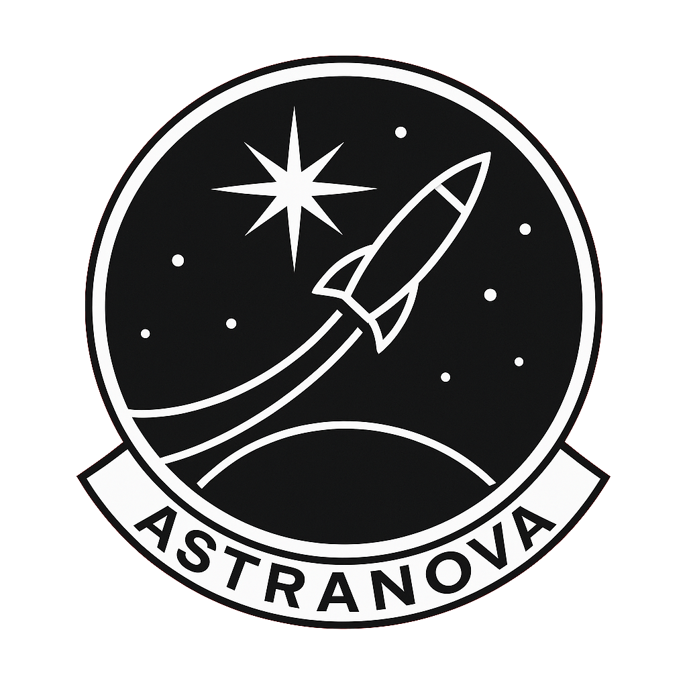
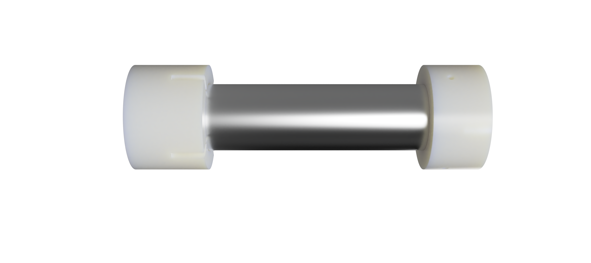
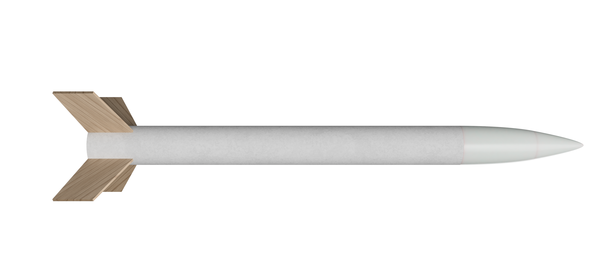
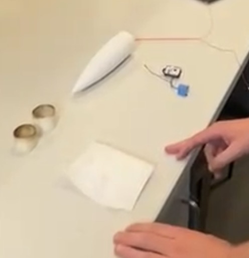
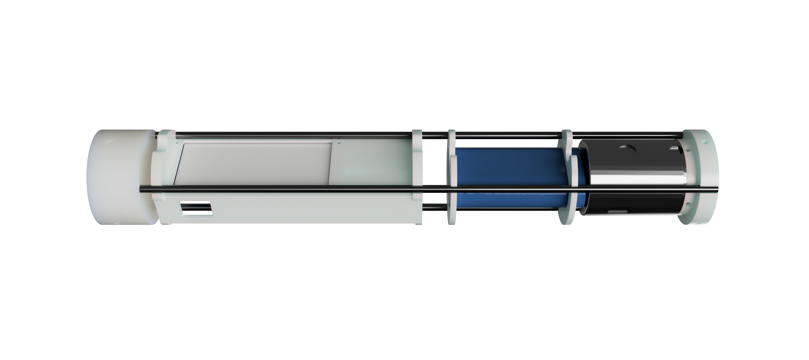
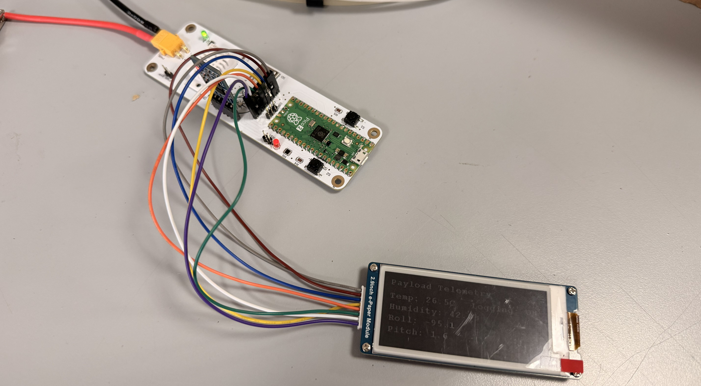

# UKC AstraNova: UKSEDS National Rocketry Championship 2025-26

**UKC AstraNova** is a student rocketry team from the **University of Kent**, competing in the **UKSEDS National Rocketry Championship (NRC) 2025-26**. This repository is the team's full project record, organised by subsystem; propulsion, structures, recovery, the customer payload, the avionics and rideshare payload, the systems engineering and design reviews, and the supporting documentation. The mission: design, build, and fly a rocket that reaches **670 m**, carries a customer payload alongside the team's own rideshare payload, records its flight data on-board, and recovers safely within **1 km** of the launch site.

> **Flight outcome:** the rocket flew a clean, stable, vertical boost, which validated the aerodynamic and stability design. At apogee it pitched over rather than nosing straight down, so the recovery flight computer's near-freefall deployment condition never triggered and the vehicle came in ballistic. The airframe was lost; the avionics board survived intact. The team took home a UKSEDS **"RUD of the Day"** plaque. The recovery and avionics failures are diagnosed honestly in the [post-mortem](#flight-outcome-and-post-mortem).





## Summary

The vehicle is a 68.9 cm, 769 g cardboard-airframe rocket flying on a **Cesaroni Pro29 108G68-13A** motor (2-grain 29 mm, 107.8 Ns total impulse, ~1.6 s near-constant burn), targeting **670 m (about 2200 ft)**. It carries two payloads: a competition **customer payload (CPD)** powered from the airframe, and the team's own **rideshare payload (the RPD)**. The RPD is a custom flight data logger that records the flight and reports peak altitude on board. Stability sits between *1.75 to 2.5 calibre** throughout ascent, and the final design clears the rail at **19.7 m/s**. Recovery is a nose-cone separation event driven by a flash-paper ejection charge and a **Mercury V1** flight computer on an isolated battery, deploying a 24" Spherachute. The project is documented end to end through the Critical Design Review, Manufacturing Review, and Flight Readiness Review, with a full requirement compliance matrix and mass, power, and financial budgets. The rocket flew, the ascent was stable and straight, and two things then went wrong; both are written up below because the lessons are the real output.

## Key points

- **Mission.** Reach 670 m, carry both payloads, retrieve flight data, and recover within 1 km of the pad, in full compliance with UKSEDS NRC safety rules.
- **Propulsion.** Cesaroni Pro29 108G68-13A; a 2-grain 29 mm motor chosen for its near-constant thrust, giving a steady burn and enough early thrust to clear the rail at speed.
- **Structures.** Cardboard body tube (about 50 mm internal diameter), four lightweight plywood trapezoidal fins, and an ABS-GF (glass-filled ABS) Ogive nose cone with a tight-fitting shoulder; total length 68.9 cm, mass 769 g, validated to hold a 2 kg suspended load without significant deflection.
- **Stability and ascent.** Stability margin held at 2.44 calibres; rail exit at 19.7 m/s; the flight confirmed a stable, vertical boost.
- **Recovery.** Mercury V1 altimeter and flight computer on an independent, isolated battery; flash-paper ejection charge fired by an igniter; nose-cone separation; 24" Spherachute with swivel; Kevlar shock cords over 2 m.
- **Customer payload (CPD).** Powered over a regulated 5 V bus through a keyed XT30 connector from a 4 A buck converter; unpressurised bay for barometric operation; mounted on a removable 3D-printed avionics sled with a bayonet-style twist lock.
- **Rideshare avionics (the RPD).** A from-scratch 2-layer PCB (102 g installed); Raspberry Pi Pico 2 (RP2350), Waveshare 10-DOF IMU (ICM-20948 + BMP280), micro-SD logging, 2.9" e-paper readout, DHT22, buzzer and status LED; barometric altitude at 50 Hz; CSV logging with a Python plotting script; on-board apogee display that holds its value without power; silkscreened team logo.
- **Power.** Shared 7.4 V 2200 mAh 2S Li-ion pack (18650CA-2S-3J, 2.2 A max discharge); a 4 A buck converter feeds the customer payload, an LDO chain feeds the RPD; about 50 minutes of runtime against a combined draw near 1.56 A.
- **Systems and documentation.** CDR, MR, and FRR submissions, a full NRC requirement compliance matrix, and mass, power, and financial budgets all live in this repository.

## Team

University of Kent; supported by the university Physics Society (PhySoc).


| Name | Role | Year / Course |
| --- | --- | --- |
| Cara-Alexandra Hefer | Team Lead / Systems Engineer | 1st / Astronomy, Space Science and Astrophysics |
| Calum Lewis | Vice Team Lead / Avionics Lead | 2nd / Electrical and Electronic Engineering |
| Lucian Willcock | Payload Lead / Avionics | 1st / Physics with Astrophysics |
| Arda Aydinlar | Systems and Structures Engineer | 2nd / Physics with Astrophysics |
| Theodoros Zilios | Recovery / CAD (Propulsion and Recovery) | 1st / Mechanical Engineering |
| Adam McGrath | Recovery Technician | 2nd / Physics |
| Alexander Barry Dee | Propulsion Engineer | 2nd / Physics with Astrophysics |
| Jack Oliver Shorey | Propulsion Engineer | 4th / Physics with Astrophysics |
| Robert Charles Langley Parry | Structural Engineer | 2nd / Ecology and Conservation |

## Subsystems

Each subsystem has its own folder; the highlights and owners are below.

**Systems** (`Systems/`; Cara, Arda). Mission definition, requirement compliance across the MOR, SMN, SAR, ESS, RRS, MIS, CPD, and RPD requirement sets, the mass, power, and financial budgets, and the CDR, MR, and FRR review submissions.

**Propulsion** (`Propulsion/`; Alexander, Jack). Motor selection and characterisation around the Cesaroni Pro29 108G68-13A, thrust-curve analysis, and the rivet-retained 3D-printed motor mount with vibration and compression testing.




**Structures** (`Structures/`; Robert, Arda; CAD by Theodoros). Airframe and fins; a cardboard body tube, four plywood trapezoidal fins chosen for low mass, and an Ogive nose cone, load-tested above 2 kg; OpenRocket model and flight simulation.




**Recovery** (`Recovery/`; Theodoros, Adam; CAD by Theodoros). Nose-cone separation system and nose cone;  ABS-GF nose cone. a flash-paper ejection charge, a Mercury V1 flight computer on an isolated battery, a 24" Spherachute, and Kevlar shock cords, all kept electrically isolated from the rest of the vehicle.




**Payloads** (`CPD/` and `RPD/`; Lucian and Calum on Payloads).The custom flight data logger; PCB design in Fusion 360 Eagle and fabrication at JLCPCB with in-house SMD assembly (`Avionics/`), and the RP2350 firmware and recorder design (`RPD/`), covering the flight-data, apogee-display, and additional-sensor requirements.





**Avionics** (`Avionics/`; Calum and Lucian on Avionics). Overseeing all electronics, including RPD, CPD, and recovery integration and mechanical fit; powering over the regulated 5 V XT30 bus, the unpressurised bay, and the avionics sled and adapter interface. 


## Flight outcome and post-mortem

### What went well

- **Stable, vertical ascent.** The boost was clean and straight, validating the aerodynamic and stability design; the stability margin held in the intended 1.75 to 2.5 calibre band and the vehicle tracked straight off the rail.
- **ABS-GF thermal margin.** The printed parts were made in ABS-GF for its rigidity and heat resistance, since the team was concerned the motor casing might melt nearby plastic. In flight the heat was not an issue at all; the parts came through untouched.
- **Flew on a substitute motor.** The vehicle flew successfully even though it launched on a motor it had not been tuned for (see below), which speaks to margin in the design.

### What went wrong

**Motor substitution.** The motor the team had ordered through UKSEDS was taken before launch, so AstraNova was issued a different motor that the flight had not been calculated or simulated for. The rocket flew regardless, but this changed the expected flight profile.

**Recovery (vehicle level).** Deployment depended on the Mercury V1 detecting a near-freefall, under 1 g condition at apogee. Because the rocket flew so straight on the way up, it carried that momentum over the top and pitched sideways rather than nosing into a clean vertical descent; it never "went straight down." Broadside, aerodynamic load kept the measured acceleration above 1 g, so the deployment window never opened and the rocket came in ballistic. The nose and carbon rods were destroyed on impact. The lesson is direct: a single accelerometer threshold is an unreliable apogee and deploy trigger, because a stable, non-vertical attitude at apogee never produces the expected freefall reading.

**RPD (avionics).** The board powered up, beeped, and wrote its startup calibration row, but logged no flight data. The cause was a **shared-source power brownout**. The 18650CA-2S-3J pack is rated to 2.2 A maximum discharge, and the steady draw (about 1.5 A for the customer payload plus the rideshare) already sat near 1.56 A, leaving very little headroom; the high-dropout regulator chain then gave away most of the voltage margin, and with no bulk capacitance for transient ride-through, the e-paper refresh bursts and the arm-time SD write transient pushed the pack past its limit and dropped the rail below the RP2350 brownout threshold. The board reset mid-arm and only the startup row reached the card.

→ **Full write-up: [Documentation/Avionics_RPD_and_Flight_Postmortem.md](Documentation/Avionics_RPD_and_Flight_Postmortem.md)**

## Quick specs

| Parameter | Value |
| --- | --- |
| Competition | UKSEDS National Rocketry Championship 2025-26 |
| University | University of Kent |
| Target apogee | 670 m (about 2200 ft) |
| Motor | Cesaroni Pro29 108G68-13A (2-grain 29 mm, 107.8 Ns) |
| Airframe | cardboard body tube, four plywood fins, ABS-GF Ogive nose |
| Length / mass | 68.9 cm / 769 g |
| Stability | 2.44 calibres |
| Rail exit speed | 19.7 m/s |
| Recovery | Mercury V1, flash-paper charge, 24" Spherachute |
| Battery | 7.4 V 2200 mAh 2S Li-ion (18650CA-2S-3J, 2.2 A max discharge) |
| Avionics MCU | Raspberry Pi Pico 2 (RP2350) |
| Avionics sensors | ICM-20948, BMP280, DHT22 |
| Avionics readout | 2.9" e-paper, on-board peak altitude |
| RPD mass | 102 g |

## Repository structure

```
Avionics/        avionics battery and power design
RPD/             rideshare flight data logger hardware and electronics (PCB design)
CPD/             customer payload integration and interface
Propulsion/      motor selection and mount
Recovery/        recovery system design
Structures/      airframe, fins, nose cone, OpenRocket model
Systems/         systems engineering, requirement traceability
Documentation/   design notes and the avionics + flight write-up, design reviews (CDR, MR, FRR)
Figures/         photos and renders used in the README
LICENSE
README.md
```

## License

Released under the MIT License; see [`LICENSE`](LICENSE). If you would rather the documents and figures carry a content licence (for example CC BY 4.0) separately from the code, the repository can be dual-licensed.

## Documentation note

The engineering and conclusions here are the team's own. An AI assistant was used as a writing aid to structure and draft this README and the flight write-up from the team's design reviews and post-flight diagnosis.
